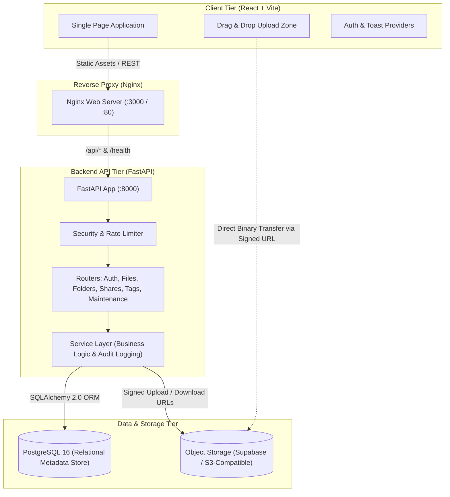

# Cloud Storage & Media Service

A modern, cloud-native, Google Drive-style media and file storage service engineered with **FastAPI**, **SQLAlchemy 2.0**, **PostgreSQL**, **React 18**, **Tailwind CSS**, and **Docker**.

---

## ✨ Features & Capabilities

- **User Authentication & Security**: Stateless JWT authentication with Argon2/bcrypt password hashing, rate limiting, and security middleware headers.
- **Hierarchical File Management**: Arbitrary nested folder structures, breadcrumb path traversal, circular-move prevention, and drag-and-drop uploads.
- **Direct & Presigned Transfers**: Scalable presigned upload/download pipelines decoupling file metadata from binary blob storage.
- **Multi-Version File History**: Upload new file versions, maintain complete revision history, and restore or download historical snapshots.
- **Collaboration & Access Control**: Granular user-to-user sharing with RBAC roles (`Owner`, `Editor`, `Viewer`), password-protected public shareable links, and expiration timestamps.
- **Soft Deletion & Recovery**: Trash bin with one-click restore and automated lifecycle purge retention.
- **Search & Storage Analytics**: Faceted full-text search across filenames/MIME types, real-time quota calculations, and category breakdowns.
- **Taxonomy & Discussions**: Custom color-coded tags and threaded comments on files for team collaboration.
- **Modern React Drive Interface**: Google Drive-inspired UI with grid/list layouts, context menus, audio/video/image inline previews, and global toast notifications.
- **Containerized Deployment**: Multi-stage Dockerfiles for backend and frontend with Docker Compose orchestration and CI/CD pipelines.

---

## 🏛️ System Architecture



---

## ⚡ Quick Start with Docker Compose

Ensure [Docker](https://www.docker.com/) and Docker Compose are installed on your system.

```bash
# 1. Clone repository
git clone https://github.com/adi9569m/cloud-storage-service.git
cd cloud-storage-service

# 2. Launch multi-container stack (Database + Backend + Frontend)
docker compose up -d --build

# 3. Access the application
# Frontend Dashboard: http://localhost:3000
# Backend OpenAPI Docs: http://localhost:8000/docs
# Backend Health Check: http://localhost:8000/health
```

---

## 🛠️ Local Development Setup

### Backend (FastAPI + Python 3.12+)

```bash
# Navigate to backend directory
cd backend

# Create virtual environment
python -m venv .venv
source .venv/bin/activate   # On Windows: .venv\Scripts\Activate.ps1

# Install dependencies
pip install -r requirements.txt

# Run automated test suite
pytest -v

# Start development API server
uvicorn app.main:app --reload --host 0.0.0.0 --port 8000
```

### Frontend (React 18 + Vite + Tailwind CSS)

```bash
# Navigate to frontend directory
cd frontend

# Install Node dependencies
npm install

# Start Vite development server
npm run dev

# Build production bundle
npm run build
```

---

## 📡 REST API Route Overview

| Module | Route Prefix | Key Endpoints | Description |
|---|---|---|---|
| **Auth** | `/api/v1/auth` | `POST /register`, `POST /login`, `GET /me`, `PUT /me`, `POST /change-password` | JWT token authentication & profile management |
| **Folders** | `/api/v1/folders` | `POST /`, `GET /`, `GET /{id}/contents`, `PUT /{id}`, `DELETE /{id}`, `POST /move` | Hierarchical directory organization |
| **Files** | `/api/v1/files` | `POST /init-upload`, `POST /complete-upload`, `GET /{id}/download`, `GET /{id}/versions` | File storage, versioning, and presigned transfers |
| **Sharing** | `/api/v1/shares` | `POST /`, `GET /shared-with-me`, `PUT /{id}`, `DELETE /{id}` | User-to-user RBAC file/folder permissions |
| **Public Links** | `/api/v1/public/links` | `POST /`, `GET /{token}`, `POST /{token}/download`, `DELETE /{id}` | Tokenized public link sharing with password & expiration |
| **Stars** | `/api/v1/stars` | `POST /`, `DELETE /`, `GET /` | Favorite items management |
| **Trash** | `/api/v1/trash` | `GET /`, `POST /restore-all`, `DELETE /empty` | Soft-deleted item recovery and permanent purging |
| **Search** | `/api/v1/search` | `GET /` | Query files and folders by name, MIME type, and date |
| **Storage** | `/api/v1/storage` | `GET /summary`, `POST /recalculate` | Quota consumption metrics and category distribution |
| **Tags** | `/api/v1/tags` | `POST /`, `GET /`, `POST /assign`, `DELETE /remove` | File and folder taxonomy labeling |
| **Comments** | `/api/v1/comments` | `POST /`, `GET /file/{file_id}`, `DELETE /{id}` | Threaded discussions on files |
| **Activity** | `/api/v1/activities` | `GET /`, `GET /resource/{type}/{id}` | Comprehensive security and audit logging |
| **Maintenance** | `/api/v1/maintenance` | `POST /cleanup-trash`, `POST /cleanup-expired-links`, `POST /sync-storage`, `GET /system-status` | Automated cleanup tasks & platform telemetry |

---

## 🧪 Verification & Testing

- **Backend Pytest Suite**: 126+ unit and integration tests covering database models, security, JWT authentication, hierarchical folder logic, file versioning, public link hashing, rate limiting, and maintenance routines.
- **Frontend Build**: Zero-warning production build compiled using Vite with minification, tree-shaking, and Gzip optimization.
- **Continuous Integration**: GitHub Actions pipeline validating backend tests and frontend production builds on every pull request.

---

## 📄 License
MIT License. Developed for learning and production cloud storage architectures.
