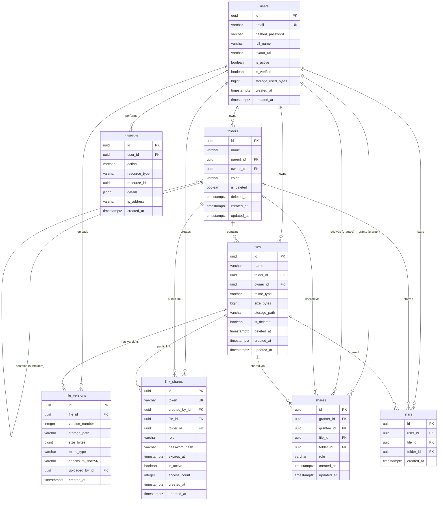

# Entity Relationship Diagram (ERD)

Below is the complete Mermaid Entity Relationship Diagram for the Cloud Storage Service database schema.

---

## Relationship Summary Table

| Relationship | Cardinality | Parent Entity | Child Entity | Description / Cascade Policy |
| :--- | :--- | :--- | :--- | :--- |
| User -> Folders | 1 : N | `users` | `folders` | User owns folders (`ON DELETE RESTRICT` for safety) |
| User -> Files | 1 : N | `users` | `files` | User owns files (`ON DELETE RESTRICT` for safety) |
| Folder -> Subfolders | 1 : N | `folders` | `folders` | Recursive folder nesting (`ON DELETE RESTRICT`) |
| Folder -> Files | 1 : N | `folders` | `files` | Folder contains files (`ON DELETE SET NULL` on hard folder delete) |
| File -> Versions | 1 : N | `files` | `file_versions` | File has historic/current versions (`ON DELETE CASCADE`) |
| User -> Shares | 1 : N | `users` | `shares` | User grants or receives item shares |
| File/Folder -> Shares | 1 : N | `files`/`folders` | `shares` | Shared file/folder (`ON DELETE CASCADE`) |
| File/Folder -> Links | 1 : N | `files`/`folders` | `link_shares` | Public shareable links (`ON DELETE CASCADE`) |
| User -> Stars | 1 : N | `users` | `stars` | Starred files/folders (`ON DELETE CASCADE`) |
| User -> Activities | 1 : N | `users` | `activities` | Activity audit trail (`ON DELETE SET NULL`) |
