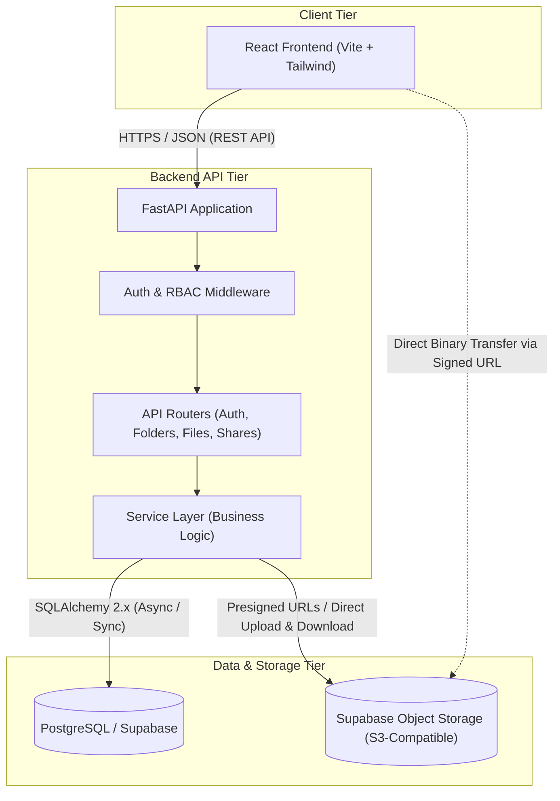

# Cloud Storage Service - Architecture Specification

## 1. System Overview

The Cloud-Based Media/File Storage Service is designed as a modular, decoupled web application following modern cloud-native best practices. The system divides responsibilities between a client-side Single Page Application (SPA), a RESTful API backend, a relational metadata store, and a distributed object storage provider.



---

## 2. Layered Responsibilities

### 2.1 React Frontend
- **Framework**: React 18+ bootstrapped with Vite, styled with Tailwind CSS.
- **State Management**: TanStack Query (React Query) for server state caching, invalidation, and optimistic updates.
- **HTTP Client**: Axios configured with interceptors for token refreshes and centralized error handling.
- **User Experience**: Google Drive-like interface featuring sidebar navigation (My Drive, Shared with Me, Starred, Trash), responsive file grid/list views, breadcrumb navigation, drag-and-drop uploads (React Dropzone), and context menus.
- **Role**: Presentational and client-side validation layer. The frontend never makes direct unauthorized database queries or assumes elevated privileges.

### 2.2 FastAPI Backend API
- **Framework**: FastAPI (Python 3.12+), utilizing Pydantic v2 for strict request and response data validation.
- **ORM / Querying**: SQLAlchemy 2.0 declarative models and sessions.
- **Authentication**: Stateless JWT authentication handling access tokens (short-lived, e.g., 15–30 minutes) and refresh tokens (long-lived, e.g., 7–30 days).
- **Authorization & Security**: Server-side Role-Based Access Control (RBAC) enforcing `Owner`, `Editor`, and `Viewer` permissions on all file/folder operations.
- **Metadata Management**: Orchestrates directory hierarchy traversals, trash/restore states, file versioning records, activity audit logging, and share links.
- **URL Signing**: Generates secure, short-lived signed URLs for direct binary file uploads and downloads to/from Supabase Storage.

### 2.3 PostgreSQL Database (Supabase)
- **Engine**: PostgreSQL 15+.
- **Primary Function**: Relational metadata storage.
- **Stored Data**: User accounts, passwords (bcrypt hashes), folder hierarchical tree structures, file metadata (names, MIME types, sizes, versions, storage paths, soft-delete states), access control lists (user shares), public share tokens, starred records, and activity logs.
- **Integrity**: Enforced via foreign key constraints, composite unique indexes, check constraints, and indexed foreign keys.

### 2.4 Object Storage (Supabase Storage / S3-Compatible)
- **Function**: Pure binary blob storage.
- **Structure**: Private storage bucket partitioned logically by user and file IDs (e.g., `uploads/{user_id}/{file_id}/{version_number}_{filename}`).
- **Access Model**: The bucket is private by default. Direct public reading/writing is forbidden. Clients read and write objects using time-limited Signed URLs generated by the FastAPI backend after rigorous authorization validation.

---

## 3. Core Architectural Decisions

### 3.1 Separation of File Metadata vs. Binary Data
Binary data is never stored directly inside the PostgreSQL database (no `BYTEA` columns). Instead:
1. Object binaries are persisted in object storage (Supabase Storage).
2. The database stores rich metadata, ownership records, access permissions, and object paths.
3. This guarantees database performance, lightweight backups, and scalable bandwidth utilization.

### 3.2 Direct / Presigned Upload Flow
To optimize backend throughput and avoid piping multi-gigabyte uploads through Python web worker threads:
1. **Initiate Upload**: Client sends file metadata (name, size, MIME type, destination folder) to FastAPI (`POST /files/init-upload`).
2. **Authorize & Sign**: FastAPI verifies user permissions, validates quotas/limits, creates a pending metadata record, and requests a Presigned Upload URL from Supabase Storage.
3. **Direct Upload**: Client streams binary data directly to Supabase Storage via `PUT` to the signed URL.
4. **Complete Upload**: Client notifies FastAPI (`POST /files/complete-upload`). FastAPI confirms upload status, registers the active version in `file_versions`, updates file size, and logs the upload activity.

### 3.3 Authorization & Permission Model
All authorization checks are enforced server-side within FastAPI route dependencies and service guards:
- **Resource Ownership**: Users have full control over files/folders where `owner_id == current_user.id`.
- **Direct Sharing (`shares`)**:
  - `VIEWER`: Read-only access to file metadata and download signed URLs.
  - `EDITOR`: Read and update access (rename, move, upload new version, soft delete).
- **Public Shareable Links (`link_shares`)**: Token-based access. Optional expiration date verification and Argon2/Bcrypt password validation.
- **Inherited Permissions**: Permissions granted on a parent folder cascade down to all subfolders and files contained within that folder hierarchy.

### 3.4 Soft Deletion Strategy (Trash & Restore)
- Deleting an item does NOT execute a SQL `DELETE` statement.
- Instead, `is_deleted` is flagged as `True` and `deleted_at` is stamped with the current UTC timestamp.
- Standard queries filter with `WHERE is_deleted = false`.
- The Trash view lists items where `is_deleted = true`.
- Permanent deletion executes hard `DELETE` queries and purges storage objects from Supabase Storage.

---

## 4. API Design Standards

- **RESTful Endpoints**: Consistent resource naming (`/api/v1/auth`, `/api/v1/folders`, `/api/v1/files`, `/api/v1/shares`).
- **HTTP Status Codes**:
  - `200 OK` / `201 Created` / `204 No Content` for successful requests.
  - `400 Bad Request` for invalid input parameters.
  - `401 Unauthorized` for missing/invalid authentication credentials.
  - `403 Forbidden` for authenticated users lacking sufficient permissions.
  - `404 Not Found` for nonexistent or soft-deleted resources.
  - `409 Conflict` for duplicate names or conflicting states.
  - `422 Unprocessable Entity` for Pydantic validation failures.
- **Standardized Error Envelope**:
  ```json
  {
    "detail": "Descriptive error message",
    "error_code": "RESOURCE_NOT_FOUND"
  }
  ```

---

## 5. Containerization & Production Topology

The service is fully containerized for deployment via Docker and orchestration with Docker Compose, Kubernetes, or container engines:

- **Frontend Container (`nginx:alpine`)**:
  - Serves static compiled SPA assets.
  - Implements Gzip compression and long-lived client caching for `/assets/`.
  - Re-routes `/api/` and `/health` requests to backend containers.
  - Implements SPA routing fallback (`try_files $uri $uri/ /index.html`).
- **Backend Container (`python:3.12-slim`)**:
  - Runs Uvicorn production ASGI server with multi-worker concurrency.
  - Hardened with non-root Linux user `appuser`.
  - Configured with native healthcheck probing `/health`.
- **Database Container (`postgres:16-alpine`)**:
  - Encapsulates relational schema and metadata tables.
  - Uses persistent Docker named volume `postgres_data`.
  - Configured with `pg_isready` readiness probe.

